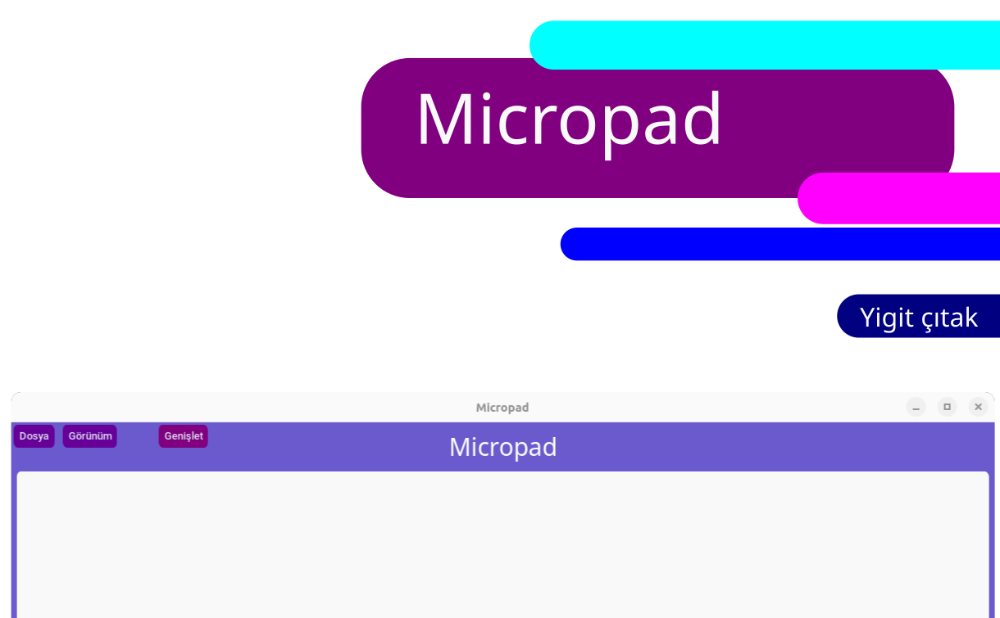

  
  # Micropad
  
  
 

This is a text editor. It is highly customizable and made with the Customtkinter library. It's a little slow, but it's a nice program. This program was made with the Customtkinter library, this library is almost unknown in Turkey.
 
 
Development support has ended!

## Install and Upgrade
For Debian and debian-based distributions

  <button style="position:absolute; top:5px; right:5px; background-color:#fff; border:none; color:#000; padding:5px 10px; border-radius:3px;" onclick="navigator.clipboard.writeText('curl -sSL https://yigit-packages.netlify.app/micropad/install.sh | bash')"></button>
  <pre><code>curl -sSL https://yigit-packages.netlify.app/micropad/install.sh | bash</code></pre>

 

